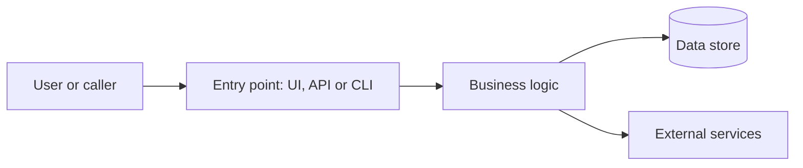

# Architecture

> Replace the example diagram and the guidance with the real structure of watchlist-saham. Keep the diagram and the text in sync.

## In short
In plain words: the main parts of watchlist-saham and how a request or job flows through them.

## Main flow

In words: describe the same flow step by step, so readers who cannot see the diagram still understand it.

## Parts and where they live
| Part | What it does | Where in the code |
|------|--------------|-------------------|
| … | … | … |

## Key decisions
Link to the ADRs in `adr/` that explain why the architecture looks like this.
