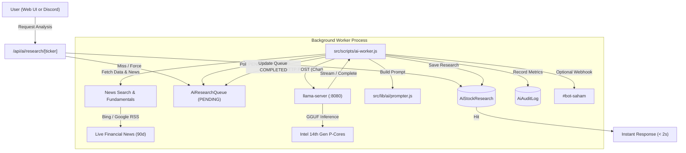

# Local AI Research Engine & Asynchronous Queue

## 1. Overview & Motivation

The application features a fully self-hosted, on-demand AI stock research engine. Rather than relying on costly third-party cloud APIs with variable rate limits or privacy leaks, the system executes locally using **`llama.cpp`** in a dedicated Docker container running quantized GGUF models (`Qwen3.8-4B-Distill-GGUF` or equivalent).

To prevent long-running AI inference (15–40 seconds on modern multi-core CPUs) from blocking Next.js API route handlers or causing HTTP gateway timeouts (such as Vercel/Cloudflare 10-60s limits), all AI analysis requests follow an **asynchronous producer-consumer queue pattern**.

---

## 2. Infrastructure & Hardware Tuning (`docker-compose.ai.yml`)

The inference server runs using the official `ghcr.io/ggml-org/llama.cpp:server` container image, configured specifically for Intel hybrid architectures (e.g. Core i5-14500: 6 Performance Cores + 8 Efficient Cores, 20 Threads):

| Argument | Value | Purpose & Architectural Rationale |
| :--- | :--- | :--- |
| `-m` | `${AI_MODEL_PATH}` | Absolute path to GGUF model mounted from host (`${LMSTUDIO_MODELS_PATH:-~/.lmstudio}:/models`). |
| `-c` | `8192` | Context window length. Sufficient for ~1.5k prompt tokens + ~4k generation tokens while maintaining a compact KV cache footprint in RAM. |
| `-t` | `6` | Number of generation threads. Locked strictly to **6 physical P-Cores** to prevent performance degradation caused by context switching onto slow E-Cores. |
| `-tb` | `12` | Number of prompt processing (prefill/batch) threads. Utilizes Hyper-Threading for fast prompt digestion. |
| `--flash-attn` | `auto` | FlashAttention memory bandwidth optimization. Reduces memory pressure during long context processing. |
| `--prio` | `2` | High process thread priority (requires `SYS_NICE` capability). |
| `-np` | `1` | Single inference slot to eliminate CPU thrashing and maintain deterministic throughput. |

---

## 3. Asynchronous Queue Architecture

### Queue Table (`AiResearchQueue`)
1. **Producer (`POST /api/ai/research`)**: Inserts or updates an entry for ticker `T` with status `PENDING`. Checks 30-day cache validity (`CACHE_VALIDITY_DAYS = 30`), allowing immediate bypass when `{ force: true }` is supplied.
2. **Consumer (`src/scripts/ai-worker.js`)**: Polls the queue every 3 seconds (`POLL_INTERVAL = 3000`) for records where `status = 'PENDING'`.
3. **Stale Job Auto-Recovery**: Prior to polling, automatically identifies dead jobs stuck in `PROCESSING` for > 10 minutes (`STALE_JOB_TIMEOUT_MS = 600000`) and resets them to `FAILED` so tickers are never permanently locked.
4. **Processing Lock**: Transitions status to `PROCESSING` to prevent concurrent duplicate inference.
5. **Robust Parsing**: Extracts sections (valuation, trend) using resilient regex patterns that tolerate markdown heading variations.
6. **Completion**: Once inference succeeds, saves the generated analysis to `AiStockResearch`, logs telemetry to `AiAuditLog`, and marks the queue item `COMPLETED`. On error, marks `FAILED` with error details.
7. **Proxy Whitelist**: Public `GET /api/ai/research` endpoints are exempted in Edge proxy so unauthenticated guests can view published research dossiers.

---

## 4. News Aggregation & Real-Time Context (`src/lib/ai/search.js`)

To ensure the AI evaluates current market catalysts rather than hallucinating past conditions, the engine pulls real-time headlines using a dual-feed RSS aggregator:
- **Primary Source**: Bing News RSS (`https://www.bing.com/news/search?q=...&format=rss`) which supplies detailed article snippets and clean pubDates.
- **Secondary Fallback**: Google News RSS (`https://news.google.com/rss/search?q=...`).
- **Sanitization & Age Filter**:
  - Company names are cleaned by removing legal entity suffixes (`PT`, `Tbk`, `Persero`).
  - Articles older than 90 days (`MAX_NEWS_AGE_DAYS = 90`) are discarded to prioritize fresh corporate actions, dividend announcements, and quarterly earnings releases.

---

## 5. Telemetry & Audit Logging (`AiAuditLog`)

Every AI inference run is recorded in `AiAuditLog` for performance monitoring and LLM observability:
- `modelName`: Name of GGUF model used (e.g. `Qwen3.8-4B-Q4_K_M.gguf`).
- `promptTokens` & `completionTokens`: Token count measured directly from llama.cpp response metadata.
- `latencyMs` & `durationSec`: Wall-clock processing time.
- `tokensPerSec`: Measured output speed (typically 18–25 tokens/s on modern desktop CPUs).
- `prompt` & `response`: Exact inputs and outputs for regression testing and prompt quality refinement.

---

## 6. Frontend Integration (`src/components/StockExplorer.jsx`)

1. When a stock is viewed, `StockExplorer` fetches existing research via `GET /api/ai/research/[ticker]`.
2. If no research exists or status is `PROCESSING`, the UI displays an animated status badge and polls every 4 seconds.
3. The user can click **"Riset Ulang AI"** to force re-enqueue a fresh background analysis.
4. Generated markdown is parsed by a custom lightweight renderer (`renderAiMarkdown`) supporting headings, bullet points, and highlighted recommendation callouts (BELI 🚀, TAHAN ⚖️, JUAL ⚠️).
