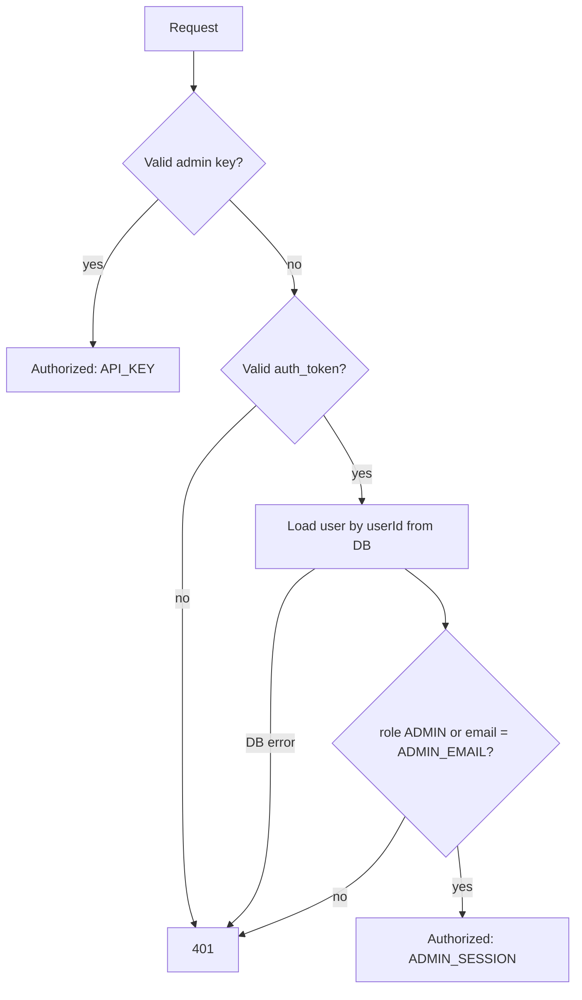

# Authentication & Admin Access

**In one sentence:** you log in and get a cookie that proves *who you are*; admin-only actions (such as uploading KSEI data) then check the database to see *whether you are an admin right now*.

---

## 1. Login session (JWT cookie)

* `POST /api/auth/login` and `POST /api/auth/register` create an `auth_token` cookie (httpOnly, 30 days).
* The cookie holds a signed JWT (HMAC-SHA256 with `JWT_SECRET`) containing `userId`, `email`, `name` and `role`.
* Code: `signToken` / `verifyToken` in `src/lib/auth.js`.
* Registration makes a user `ADMIN` when it is the very first user, or when the email equals `ADMIN_EMAIL` (case-insensitive).

## 2. The API proxy (`src/proxy.js`)

Every `/api/*` request passes through the Next.js proxy (formerly called middleware) first.

| Request | Result |
| :--- | :--- |
| Public endpoints (`/api/auth/login`, `/api/auth/register`, `/api/alpha-legend`, …) | Allowed |
| `/api/ksei/ingest` with an `x-admin-key` or `Authorization: Bearer …` header | Allowed through — the route checks the key itself (`src/lib/adminKeyRequest.js`) |
| Any other `/api/*` without a valid `auth_token` cookie | `401 Unauthorized: Missing/Invalid Authentication Token` |

## 3. Admin-only endpoints (`verifyAdminAccess`)

Used by `/api/ksei/ingest`, `/api/sync` (POST) and `/api/admin/add-ticker`. It is `async`, so routes call `await verifyAdminAccess(request)`.

Access is granted when **either**:

1. **Admin API key** — the `x-admin-key` header or `Authorization: Bearer <key>` equals `ADMIN_SECRET_KEY` (timing-safe comparison).
2. **Admin session** — the `auth_token` cookie is valid **and** the user *loaded from the database* has `role = 'ADMIN'`, or an email equal to `ADMIN_EMAIL` (case-insensitive, see `isAdminUser`).

### Why the role is read from the database, not the JWT

Tokens live for 30 days. A role stored inside the token goes stale:

* Tokens created before the role was added to the JWT have **no role at all**, so admins were wrongly rejected with 401.
* Promoting a user to `ADMIN` in the database would not work until they logged in again — and removing admin rights would not take effect for up to 30 days.

Reading the role from the database on each admin request fixes all three. The cost is one small indexed query per admin request, which is acceptable for these rare endpoints. If the database query fails, access is **denied** (fail closed) and the error is logged.

## Troubleshooting a 401 on an admin endpoint

Look at the `error` text in the response:

| Message | Cause | Fix |
| :--- | :--- | :--- |
| `Missing Authentication Token` / `Invalid or Expired Token` | No cookie, expired cookie, or `JWT_SECRET` changed | Log in again (or send the admin key for `/api/ksei/ingest`) |
| `Login sebagai Admin atau sertakan Admin Key diperlukan` | Logged in, but the DB user is not `ADMIN` and the email ≠ `ADMIN_EMAIL` | Set `role = 'ADMIN'` for the user in the database |
| `Gagal memverifikasi akses Admin` | Database unreachable | Check the database and the app logs |
