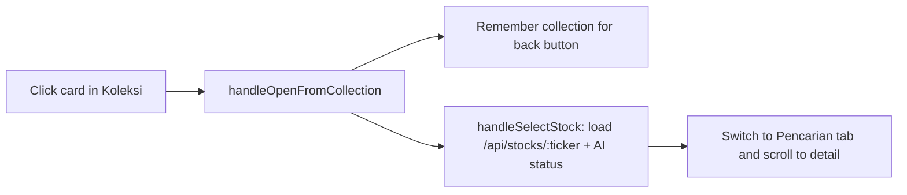

# Stock Explorer Pages

**In one sentence:** Stock Explorer has three tabs — your saved collections, a stock search with full analysis, and a side-by-side comparison — and clicking a stock in a collection opens its full analysis.

Code: `src/components/StockExplorer.jsx` (state `activeTab`: `'collections' | 'explorer' | 'compare'`).

Look: "Bursa 1985" tokens ([Design System](./design-system.md)). The page title and the three tabs stay sticky under the mobile header (`top-12`, `top-0` on desktop). The analysis cockpit uses the standard `.tabs` / `.tab` classes; all 9 dialogs use `.modal-backdrop` / `.modal-panel` (bottom sheet on phones). In the stock banner "Simpan ke Koleksi" is the only primary button.

---

## 1. Koleksi Saham (default tab)

A full-width page for the user's collections (watchlists).

| Part | What it shows |
| :--- | :--- |
| Header | Title, number of collections, **+ Buat Koleksi** |
| Collection chips | One chip per collection (emoji, name, item count); click to switch |
| Collection toolbar | Name, description, *Publik* badge, *Live 30s* status, refresh / edit / share link / delete |
| Summary row | Number of stocks (up/down), average daily % change, buy targets hit, sell targets hit |
| Sort bar | `CollectionSortDropdown` (see [Collection Sorter Engine](../trading-system/collection-sorter-engine.md)) + drag-and-drop hint |
| Card grid | Up to 5 cards per row on wide screens (1 / 2 / 3 / 4 / 5 columns at base / sm / lg / xl / 2xl). Ticker, composite score, daily change, name/sector, price, target-hit banner, price position between buy and sell target, notes, action buttons |

Card actions (always visible, also on mobile): 🎯 monitor in Win Rate, ⚖️ add to Komparasi, 📦 move to another collection, ✏️ edit notes/targets, ✕ remove.

The card calculations live in `src/lib/collectionCardUtils.js` (unit-tested in `tests/collectionCardUtils.test.js`):

* `getCompositeScore(scores)` — fundamental 45% + technical 35% + trending 10% + smart money 10% (missing = 50).
* `getScoreTone(score)` — badge colour: ≥80 excellent, ≥65 good, ≥50 fair, else poor.
* `getTargetStatus(price, targetBuy, targetSell)` — buy hit when price ≤ target buy; sell hit when price ≥ target sell; price 0 never hits.
* `getTargetProgress(price, targetBuy, targetSell)` — 0% at target buy, 100% at target sell (clamped).
* `summarizeCollection(items)` — counts and simple average of daily % change.

Prices refresh every 30 seconds while the browser tab is visible.

## 2. Pencarian Saham IDX

Search box with autocomplete (top 8 matches on ticker or company name), then the full stock analysis: banner, 8 analysis cards, chart and the analytical cockpit tabs.

* On first load BBCA is preloaded **silently** (the user stays on the Koleksi tab).
* When the stock was opened from a collection, a **← Kembali ke Koleksi** button shows the source collection. Picking a stock from the search suggestions hides it.

## 3. Komparasi

Head-to-head comparison of up to 6 stocks (unchanged).

## Click flow from a collection

