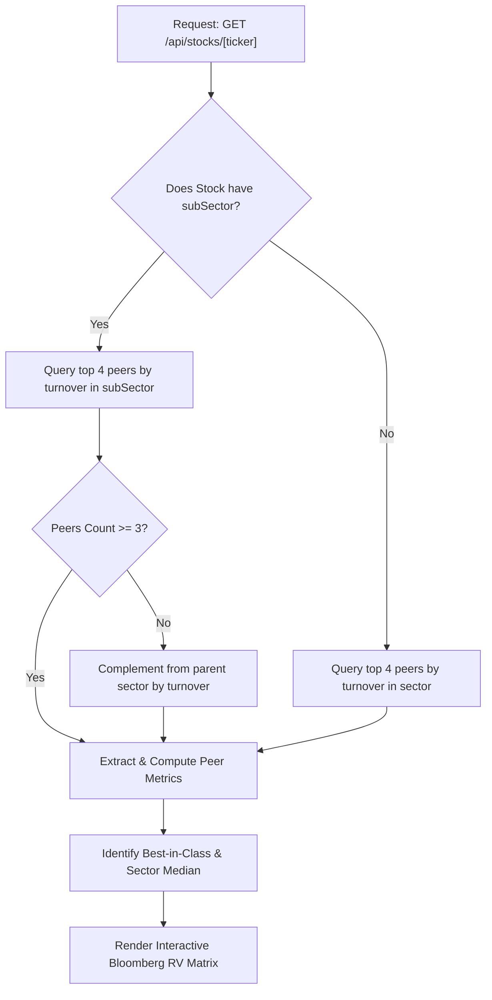

# Bloomberg Relative Valuation (RV) & Peer Comparison Engine

## 1. Overview & Institutional Purpose

In institutional equity research (inspired by Bloomberg Terminal function `RV <GO>`), no valuation ratio exists in a vacuum. A Price-to-Earnings (PER) of $12\times$ may appear cheap for a high-growth tech platform, but expensive for a utility company.

The **Relative Valuation (RV) Engine** provides automated, side-by-side benchmarking of a target stock against its top 3–4 direct industry peers operating within the exact same IDX sub-sector (or sector):
- Evaluates whether valuation premiums or discounts are justified by underlying return on equity (ROE) and profit margins.
- Identifies **Best-in-Class** leaders across profitability, dividend yield, and financial health.
- Prevents value traps by comparing the target stock against peer medians rather than arbitrary cross-sector static thresholds.

---

## 2. Peer Selection Algorithm

When a stock is analyzed via `GET /api/stocks/[ticker]`:
1. **Sub-Sector Specificity**: Queries the database for active, non-delisted companies sharing the identical `subSector` (e.g. `bank`, `coal mining`, `telecommunication`).
2. **Turnover & Liquidity Weighting**: Sorts peer candidates by daily trading turnover (`turnover: 'desc'`) to benchmark against liquid market leaders rather than illiquid penny stocks.
3. **Sector Backfill**: If a niche sub-sector has fewer than 3 peers, the engine complements the cohort with top-turnover peers from the parent `sector`.
4. **Data Normalization**: Strips invalid or negative earnings multiples (PER $< 0$) from low-valuation rankings to prevent loss-making companies from being falsely marked as "cheap".

---

## 3. Evaluated Metrics & Benchmark Taxonomy

| Metric | Code | Best-in-Class Criterion | Financial Rationale |
|---|---|---|---|
| **PER (TTM)** | `per` | Lowest positive PER ($\min_{s > 0}$) | Cheapest earnings multiple relative to current profitability. |
| **PBV** | `pbv` | Lowest positive PBV ($\min_{s > 0}$) | Deepest discount to net asset book value. |
| **ROE (%)** | `roe` | Highest ROE ($\max$) | Maximum net income generated per Rupiah of shareholder equity. |
| **NPM (%)** | `npm` | Highest Net Profit Margin | Superior operating cost efficiency and pricing power. |
| **Dividend Yield** | `dividendYield` | Highest Yield ($\max$) | Superior passive income cash distribution. |
| **DER** | `der` | Lowest Debt-to-Equity | Lowest balance sheet financial leverage and insolvency risk. |
| **Graham MoS** | `marginOfSafety` | Highest positive MoS | Widest margin of safety below Graham Intrinsic Value. |
| **Composite Score** | `score` | Highest Score (0–100) | Best multi-factor balance across fundamentals and technicals. |

---

## 4. Automated Comparative Insights

The component dynamically synthesizes a natural language institutional verdict:
- **ROE Superiority**: Highlights when the target stock beats all industry peers in capital efficiency.
- **Valuation Relative to Median**: Benchmarks current PER against peer median:
  $$\text{Is Undervalued} = \text{PER}_{\text{target}} < \text{Median}(\text{PER}_{\text{peers}})$$
- **Income Leadership**: Flags highest-yielding dividend payers in the peer group.

---

## 5. UI Integration & Head-to-Head Bridge

The component is rendered in `StockExplorer.jsx`:
- **Direct Navigation**: Clicking any peer ticker instantly navigates to that stock's complete analysis dossier.
- **Compare Bridge**: Clicking `⚖️ Buka Komparasi Lengkap` automatically stages all peer tickers into the multi-stock comparison workbench for deep multi-year charting.

