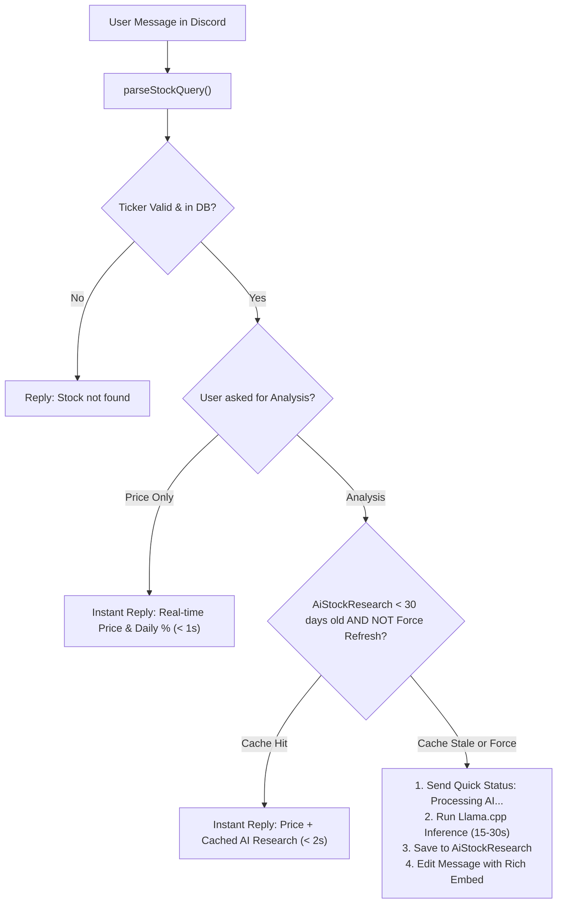

# Interactive Discord Bot & Notification Engine

## 1. Overview

The platform supports two distinct communication modes with Discord:
1. **One-Way Webhook Alerts (`src/scripts/discord-notifier.js`)**: Automatically transmits morning screening picks, real-time `WIN (TP)`, `LOSS (SL)`, and `Time Stop` trade completion events.
2. **Interactive Two-Way Bot (`src/scripts/discord-bot.js`)**: An intelligent assistant powered by `discord.js` v14 that listens in designated channels (e.g. `#bot-saham`), interprets natural language Indonesian inquiries, extracts stock tickers, provides real-time quotes, and triggers deep AI fundamental research on demand.

---

## 2. Natural Language Intent & Ticker Extraction

The bot includes an algorithmic parser (`parseStockQuery`) capable of isolating 4-letter IDX tickers from conversational Indonesian text without requiring strict command prefixes (such as `!cek` or `/analyze`):

- **Supported Conversational Patterns**:
  - *"tolong cek harga elsa sekarang dan analisamu apa?"* $\rightarrow$ Ticker: `ELSA`, Intent: `analisa`
  - *"analisa itic dong"* $\rightarrow$ Ticker: `ITIC`, Intent: `analisa`
  - *"gimana prospek bbri?"* $\rightarrow$ Ticker: `BBRI`, Intent: `analisa`
  - *"harga tlkm berapa?"* $\rightarrow$ Ticker: `TLKM`, Intent: `harga`
  - *"analisa ulang asii"* $\rightarrow$ Ticker: `ASII`, Intent: `analisa`, Force Refresh: `true`

- **False Positive Protection**: Common 4-letter Indonesian words (e.g., `DONG`, `BISA`, `PADA`, `SAYA`, `KITA`, `BAGI`, `HARI`, `DARI`, `MAKA`, `LAGI`) are filtered through an exclusion blacklist to prevent accidental lookups.

---

## 3. 30-Day Smart Research Caching Policy

Running local GGUF models on multi-core CPUs requires 15–40 seconds per inference. To maintain high responsiveness and avoid redundant computation, the bot enforces a **30-day freshness cache policy**:

1. **Cache Hit (< 30 Days)**: If an analysis exists for the ticker and was generated within the past 30 days (and the user did not explicitly request an *"analisa ulang"* or *"refresh"*), the bot responds immediately (< 2 seconds) with the latest live market price alongside the existing AI research summary.
2. **Cache Miss / Stale (> 30 Days) / Forced Refresh**: The bot immediately sends an acknowledgment (*"⏳ Sedang melakukan riset AI untuk [TICKER]..."*), fetches live Bing/Google financial news, generates a comprehensive report via `llama.cpp`, persists the result to `AiStockResearch`, logs telemetry in `AiAuditLog`, and edits the initial message into a full Rich Embed.

---

## 4. Discord Rich Embed Visual Formatting

Analysis results are rendered using `EmbedBuilder` with visual indicators:
- **Color Coding**:
  - 🟢 Emerald (`0x10B981`) for `BUY` / `BELI`
  - 🔴 Crimson (`0xEF4444`) for `SELL` / `JUAL`
  - 🟡 Amber (`0xF59E0B`) for `HOLD` / `TAHAN`
- **Embedded Fields**:
  - **Market Summary**: Current Price, Daily Change (%), Volume.
  - **Valuation & Target**: Graham Intrinsic Value, Margin of Safety (%), Risk/Reward ratio.
  - **Technical Indicators**: Wilder's RSI, Supertrend signal, MACD status.
  - **AI Research Highlights**: Core investment thesis, catalyst summary, and risk considerations.
  - **Footer**: Model identifier, generation timestamp, and cache age.
