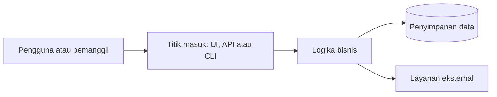

# Arsitektur

> Ganti contoh diagram dan panduan ini dengan struktur watchlist-saham yang sebenarnya. Jaga agar diagram dan teks tetap selaras.

## Singkatnya
Dengan bahasa sederhana: bagian-bagian utama watchlist-saham dan bagaimana sebuah permintaan atau pekerjaan mengalir melewatinya.

## Alur utama

Dengan kata-kata: jelaskan alur yang sama langkah demi langkah, supaya pembaca yang tidak bisa melihat diagram tetap paham.

## Bagian dan letaknya
| Bagian | Fungsinya | Letak di kode |
|--------|-----------|---------------|
| … | … | … |

## Keputusan penting
Tautkan ke ADR di `adr/` yang menjelaskan kenapa arsitekturnya seperti ini.
