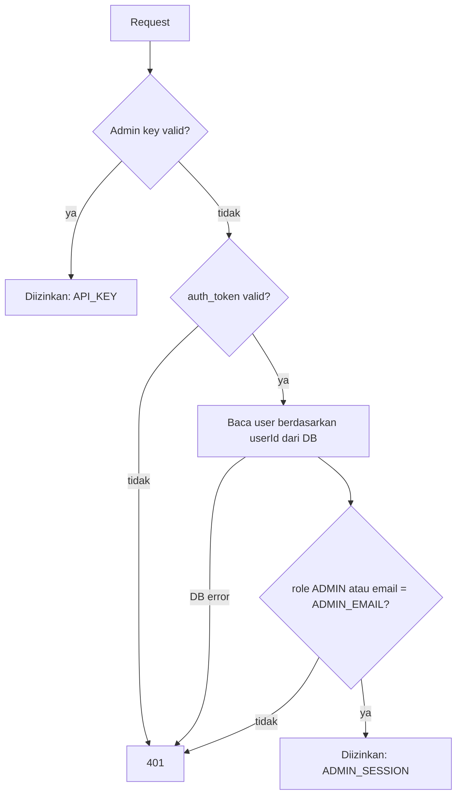

# Autentikasi & Akses Admin

**Dalam satu kalimat:** saat login kamu mendapat cookie yang membuktikan *siapa kamu*; aksi khusus admin (misalnya upload data KSEI) lalu mengecek database untuk melihat *apakah kamu admin saat ini*.

---

## 1. Sesi login (cookie JWT)

* `POST /api/auth/login` dan `POST /api/auth/register` membuat cookie `auth_token` (httpOnly, 30 hari).
* Cookie berisi JWT yang ditandatangani (HMAC-SHA256 dengan `JWT_SECRET`) berisi `userId`, `email`, `name`, dan `role`.
* Kode: `signToken` / `verifyToken` di `src/lib/auth.js`.
* Registrasi menjadikan user `ADMIN` bila ia user pertama, atau bila emailnya sama dengan `ADMIN_EMAIL` (tidak peka huruf besar/kecil).

## 2. Proxy API (`src/proxy.js`)

Setiap request `/api/*` melewati proxy Next.js (dulu disebut middleware) terlebih dahulu.

| Request | Hasil |
| :--- | :--- |
| Endpoint publik (`/api/auth/login`, `/api/auth/register`, `/api/alpha-legend`, …) | Diizinkan |
| `/api/ksei/ingest` dengan header `x-admin-key` atau `Authorization: Bearer …` | Diteruskan — route sendiri yang memvalidasi key (`src/lib/adminKeyRequest.js`) |
| `/api/*` lainnya tanpa cookie `auth_token` yang valid | `401 Unauthorized: Missing/Invalid Authentication Token` |

## 3. Endpoint khusus admin (`verifyAdminAccess`)

Dipakai oleh `/api/ksei/ingest`, `/api/sync` (POST), dan `/api/admin/add-ticker`. Fungsinya `async`, jadi route memanggil `await verifyAdminAccess(request)`.

Akses diberikan bila **salah satu** terpenuhi:

1. **Admin API key** — header `x-admin-key` atau `Authorization: Bearer <key>` sama dengan `ADMIN_SECRET_KEY` (perbandingan timing-safe).
2. **Sesi admin** — cookie `auth_token` valid **dan** user *yang dibaca dari database* memiliki `role = 'ADMIN'`, atau email sama dengan `ADMIN_EMAIL` (tidak peka huruf besar/kecil, lihat `isAdminUser`).

### Mengapa role dibaca dari database, bukan dari JWT

Token berlaku 30 hari. Role yang disimpan di dalam token bisa basi:

* Token yang dibuat sebelum role ditambahkan ke JWT **tidak punya role sama sekali**, sehingga admin keliru ditolak dengan 401.
* Mengangkat user menjadi `ADMIN` di database baru berlaku setelah login ulang — dan mencabut hak admin baru berlaku hingga 30 hari kemudian.

Membaca role dari database di setiap request admin menyelesaikan ketiganya. Biayanya satu query kecil ber-index per request admin, wajar untuk endpoint yang jarang dipanggil. Bila query database gagal, akses **ditolak** (fail closed) dan error dicatat di log.

## Troubleshooting 401 di endpoint admin

Lihat teks `error` di response:

| Pesan | Penyebab | Solusi |
| :--- | :--- | :--- |
| `Missing Authentication Token` / `Invalid or Expired Token` | Tidak ada cookie, cookie kedaluwarsa, atau `JWT_SECRET` berubah | Login ulang (atau kirim admin key untuk `/api/ksei/ingest`) |
| `Login sebagai Admin atau sertakan Admin Key diperlukan` | Sudah login, tapi user di DB bukan `ADMIN` dan email ≠ `ADMIN_EMAIL` | Set `role = 'ADMIN'` untuk user tersebut di database |
| `Gagal memverifikasi akses Admin` | Database tidak bisa diakses | Cek database dan log aplikasi |
