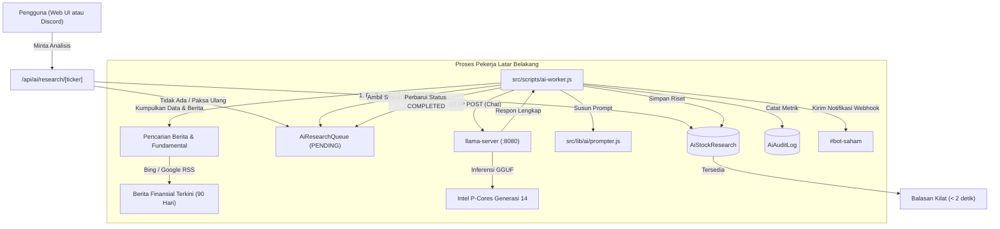

# Mesin Riset AI Lokal & Antrean Asinkron

## 1. Ikhtisar & Latar Belakang

Aplikasi ini dilengkapi dengan mesin riset fundamental saham berbasis AI yang sepenuhnya di-host secara mandiri (*self-hosted*). Untuk menghindari biaya API berbayar serta kebocoran data (*privacy leak*), proses inferensi dijalankan secara lokal menggunakan **`llama.cpp`** di dalam kontainer Docker terisolasi dengan model GGUF terkuantisasi (seperti `Qwen3.8-4B-Distill-GGUF`).

Mengingat waktu inferensi AI pada CPU multi-core modern berkisar antara 15–40 detik, sistem menerapkan pola **antrean asinkron (Producer-Consumer)** agar proses riset tidak memblokir antarmuka pengguna Next.js atau terkena batas waktu *HTTP gateway timeout*.

---

## 2. Infrastruktur & Optimasi Hardware (`docker-compose.ai.yml`)

Server inferensi berjalan menggunakan container resmi `ghcr.io/ggml-org/llama.cpp:server` dengan konfigurasi khusus untuk arsitektur hybrid CPU Intel (misal: Core i5-14500: 6 Performance Cores + 8 Efficient Cores):

| Parameter | Nilai | Tujuan & Alasan Desain Arsitektur |
| :--- | :--- | :--- |
| `-m` | `${AI_MODEL_PATH}` | Lokasi file model GGUF di dalam container yang di-mount dari host (`${LMSTUDIO_MODELS_PATH:-~/.lmstudio}:/models`). |
| `-c` | `8192` | Batas ukuran konteks token prompt dan jawaban. Efisien dalam alokasi RAM dan KV cache. |
| `-t` | `6` | Jumlah thread generasi token, dikunci tepat pada **6 P-Cores fisik** agar terhindar dari degradasi performa akibat context switching ke E-Cores. |
| `-tb` | `12` | Jumlah thread pemrosesan awal prompt (*prefill phase*) memanfaatkan Hyper-Threading. |
| `--flash-attn` | `auto` | Mengoptimalkan pemakaian memori bandwidth dan KV cache. |
| `--prio` | `2` | Prioritas thread CPU tinggi (membutuhkan kapabilitas `SYS_NICE`). |
| `-np` | `1` | 1 slot inferensi untuk memastikan komputasi stabil tanpa rebutan memori antrean CPU. |

---

## 3. Alur Antrean Asinkron

1. **Pengirim Tugas (`POST /api/ai/research`)**: Menambahkan tiket antrean saham terkait ke tabel `AiResearchQueue` dengan status `PENDING`. Memeriksa batas kesegaran riset 30 hari (`CACHE_VALIDITY_DAYS = 30`), dengan dukungan bypass langsung menggunakan `{ force: true }`.
2. **Pemroses Latar Belakang (`src/scripts/ai-worker.js`)**: Polling tabel antrean setiap 3 detik (`POLL_INTERVAL = 3000`) mencari entri berstatus `PENDING`.
3. **Pemulihan Otomatis Antrean Macet (*Stale Recovery*)**: Sebelum polling, sistem otomatis mendeteksi task berstatus `PROCESSING` yang macet lebih dari 10 menit (`STALE_JOB_TIMEOUT_MS = 600000`) akibat worker mati/crash, dan meresetnya ke `FAILED` agar saham tidak terkunci permanen.
4. **Kunci Proses**: Mengubah status menjadi `PROCESSING` guna menghindari inferensi ganda secara paralel.
5. **Ekstraksi Regex Tangguh**: Memisahkan bagian valuasi dan tren menggunakan regex fleksibel yang toleran terhadap variasi heading markdown.
6. **Penyelesaian**: Setelah inferensi berhasil, menyimpan hasil analisis ke `AiStockResearch`, mencatat metrik kinerja ke `AiAuditLog`, dan menandai status antrean menjadi `COMPLETED`.
7. **Pengecualian Proksi**: Endpoint baca publik `GET /api/ai/research` dibuka pada Edge proxy agar pengguna umum tanpa login dapat membaca berkas riset yang telah terbit.

---

## 4. Agregasi Berita Terkini (`src/lib/ai/search.js`)

Untuk memastikan model AI memiliki informasi katalis pasar terbaru:
- **Sumber Utama**: Bing News RSS (`https://www.bing.com/news/search?q=...&format=rss`) dengan ringkasan cuplikan artikel dan tanggal publikasi akurat.
- **Sumber Cadangan**: Google News RSS (`https://news.google.com/rss/search?q=...`).
- **Penyaringan Umur Berita**: Berita yang lebih lama dari 90 hari (`MAX_NEWS_AGE_DAYS = 90`) otomatis disaring agar fokus pada aksi korporasi dan kinerja kuartal terkini.

---

## 5. Metrik & Log Audit AI (`AiAuditLog`)

Setiap eksekusi riset dicatat secara terperinci ke dalam tabel `AiAuditLog`:
- `modelName`: Nama file model GGUF.
- `promptTokens` & `completionTokens`: Jumlah token input dan output.
- `latencyMs` & `durationSec`: Durasi pengerjaan.
- `tokensPerSec`: Kecepatan generasi token rata-rata (biasanya 18–25 token/detik).
- `prompt` & `response`: Riwayat teks lengkap untuk audit dan penyempurnaan prompt di masa depan.
