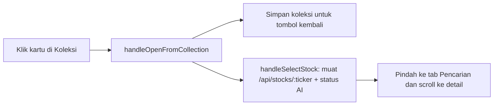

# Halaman Stock Explorer

**Dalam satu kalimat:** Stock Explorer punya tiga tab — koleksi saham tersimpan, pencarian saham dengan analisis lengkap, dan komparasi berdampingan — dan klik saham di koleksi membuka analisis lengkapnya.

Kode: `src/components/StockExplorer.jsx` (state `activeTab`: `'collections' | 'explorer' | 'compare'`).

---

## 1. Koleksi Saham (tab default)

Halaman full-width untuk koleksi (watchlist) pengguna.

| Bagian | Isi |
| :--- | :--- |
| Header | Judul, jumlah koleksi, **+ Buat Koleksi** |
| Chip koleksi | Satu chip per koleksi (emoji, nama, jumlah saham); klik untuk berpindah |
| Toolbar koleksi | Nama, deskripsi, lencana *Publik*, status *Live 30s*, refresh / edit / salin link / hapus |
| Baris ringkasan | Jumlah emiten (naik/turun), rata-rata % perubahan harian, target beli tercapai, target jual tercapai |
| Bar urutan | `CollectionSortDropdown` (lihat [Collection Sorter Engine](../trading-system/collection-sorter-engine.md)) + petunjuk geser-dan-lepas |
| Grid kartu | 1–4 kolom. Ticker, skor komposit, perubahan harian, nama/sektor, harga, banner target tercapai, posisi harga di antara target beli dan jual, catatan, tombol aksi |

Aksi kartu (selalu terlihat, juga di mobile): 🎯 pantau di Win Rate, ⚖️ tambah ke Komparasi, 📦 pindah ke koleksi lain, ✏️ edit catatan/target, ✕ hapus.

Perhitungan kartu ada di `src/lib/collectionCardUtils.js` (diuji di `tests/collectionCardUtils.test.js`):

* `getCompositeScore(scores)` — fundamental 45% + teknikal 35% + trending 10% + smart money 10% (kosong = 50).
* `getScoreTone(score)` — warna lencana: ≥80 excellent, ≥65 good, ≥50 fair, sisanya poor.
* `getTargetStatus(price, targetBuy, targetSell)` — target beli kena bila harga ≤ target beli; target jual kena bila harga ≥ target jual; harga 0 tidak pernah kena.
* `getTargetProgress(price, targetBuy, targetSell)` — 0% di target beli, 100% di target jual (dibatasi).
* `summarizeCollection(items)` — hitungan dan rata-rata sederhana % perubahan harian.

Harga diperbarui setiap 30 detik selama tab browser terlihat.

## 2. Pencarian Saham IDX

Kotak pencarian dengan autocomplete (8 hasil teratas berdasarkan ticker atau nama perusahaan), lalu analisis saham lengkap: banner, 8 kartu analisis, grafik, dan tab analytical cockpit.

* Saat pertama dibuka, BBCA dimuat **diam-diam** (pengguna tetap di tab Koleksi).
* Bila saham dibuka dari koleksi, muncul tombol **← Kembali ke Koleksi** beserta nama koleksinya. Memilih saham dari saran pencarian menyembunyikan tombol ini.

## 3. Komparasi

Perbandingan head-to-head hingga 6 saham (tidak berubah).

## Alur klik dari koleksi

